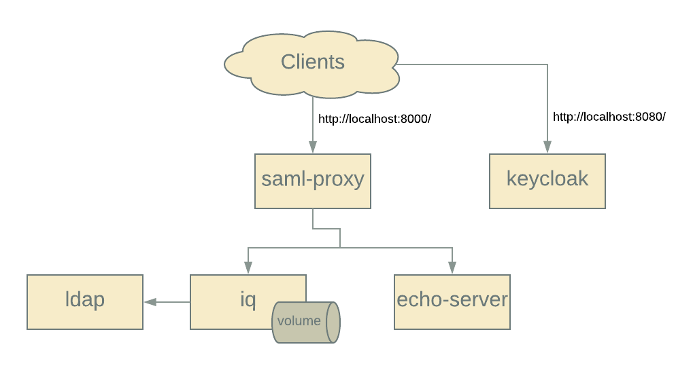
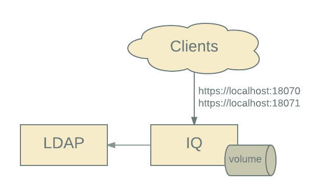

# cs-auth-proxy

Here are scripts and configuration to build a SAML-based authentication
environment for Nexus IQ using Docker and Docker Compose.



* [Overview](#overview)
* [SAML Configuration](#saml-configuration)
* [Details](#details)
  * [Alternate Deployment: IQ and LDAP](#alternate-deployment-iq-and-ldap)
  * [Scripts](#scripts)
  * [LDAP Information](#ldap-information)
  
## Overview

### Quickstart

```console
  $ bin/create-iq-volume.sh license_file
  $ docker-compose build
  $ docker-compose up -d
```

* Test SAML-based authentication at: http://localhost:8000/
* Access IQ at: http://localhost:8000/iq
* Debug Apache-level variables at: http://localhost:8000/cgi-bin/debug
* Debug HTTP requests received by the backend service at: http://localhost:8000/echo/
* Access Keycloak IdP at: http://localhost:8080.  Username / Password: `admin` / `admin123`

### Background

Some customers want SAML support for our products.  This docker-compose based
approach provides a SSO environment similar to that deployed by these
customers: 

* a reverse proxy (Apache httpd) which interacts via SAML 2.0 to authenticate
  users, and add HTTP headers to a backend IQ instance.

* a populated LDAP (OpenLDAP) with four users belonging to a combination of three groups.

* a licensed IQ instance configured to use the supplied HTTP header,
  communicate with the LDAP instance, and associate the LDAP *administrators*
  group to the *System Administrator* role.  This is provisioned locally &
  on-demand via a script.

* An authorization service (Keycloak), acting as a SAML 2.0 Identity Provider.

The base images for the environment are available on Dockerhub and customized
at runtime.

## SAML Configuration

This environment provides a fully functional SAML-based setup.  But, to be
useful as a reference implementation, more information about how Apache /
mod_auth_mellon are configured and operate is required.

### General Overview

Here is what the final authentication workflow looks like:


For us:

* The Service Provider is Apache HTTPD.
* The Identity Provider is Keycloak.

The configuration process includes the following steps:

1. **Create Service Provider metadata**. The `mod_auth_mellon` module includes
   a helper script to create an XML-formatted metadata file describing the
   service provider endpoints. *This information (specifically, service URLs
   and certificates) is required in order to configure the IdP service*.

2. **Create IdP Configuration**. The IdP needs to have the new service added,
   including what sets of users will have access, what assertions will be
   provided, etc.  *A primary output from the IdP is an XML-formatted metadata
   file which the Service Provider requires to complete configuration*.

3. **Complete SP Configuration**. The SP requires the IdP metadata file to
   complete its configuration.

4. **Configure the Proxy**.  Once the Apache SP is configured and
   authentication is working, information about from the SAML assertion must be
   passed to the service being proxied.

### Create Service Provider Metadata

`mod_auth_mellon` includes a helper script to create the SP metadata.  In
addition to creating files, it outputs important information to the console.  A
wrapper script [gen.sh](dockerfiles/saml-proxy/httpd/saml2/gen.sh) was invoked
to create this information for this environment:

```console
$ docker run -t -i --rm sonatype/saml-proxy /bin/bash

[root@86a86bf15775 /]# /etc/httpd/saml2/gen.sh 

Output files:
Private key:                              sonatype.key
Certificate:                              sonatype.cert
Metadata:                                 sonatype.xml
Host:                                     localhost:8000

Endpoints:
SingleLogoutService (SOAP):               http://localhost:8000/mellon/logout
SingleLogoutService (HTTP-Redirect):      http://localhost:8000/mellon/logout
AssertionConsumerService (HTTP-POST):     http://localhost:8000/mellon/postResponse
AssertionConsumerService (HTTP-Artifact): http://localhost:8000/mellon/artifactResponse
AssertionConsumerService (PAOS):          http://localhost:8000/mellon/paosResponse
```

### IdP Configuration

In order to add a new service to the IdP, the information generated in the
previous step is required. Keycloak (and some other IdPs) can import this
metadata directly, others may require a more manual procedure.

Arbitrary assertions can be provided by the IdP to the SP: they typically
include group membership and extended information about the user.

### Complete SP Configuration

Metadata from the IdP is required to complete `mod_auth_mellon` configuration.
This includes URLs serviced by the IdP, certificates, and other information
about the IdP.

Once a service is added to Keycloak, this metadata can be trvially retrieved:

```console
$ curl -q http://keycloak:8080/auth/realms/sonatype/protocol/saml/descriptor
```

See [Example IdP Metadata](dockerfiles/saml-proxy/httpd/saml2/idp-metadata.xml).

### Configure the Proxy

Once SAML authentication is functional, the proxy must be configured to pass
traffic to the backend service.

This [basic proxy config](dockerfiles/saml-proxy/httpd/conf.d/auth_mellon.conf):

1. requires authorization for all locations on the httpd instance.
2. uses the `MellonMergeEnvVars On` directive to allow SAML variables to be set
   in the environment.
3. sets the HTTP header `X-SSO-USER` to the `username` assertion.  Other IdP's
   may expose this information differently.

This environment contains a few tools which may help in determining the correct
configuration for another IdP.

* [/cgi-bin/debug](dockerfiles/saml-proxy/debug): a simple shell-based CGI
  script which outputs all server variables.  These variables can be used
  within Apache directives, passed via headers, etc.

* The [echo service config](dockerfiles/saml-proxy/httpd/conf.d/echo-service.conf)
proxies requests to a docker container running a simple HTTP echo service
[jswank/http-echo-server](https://hub.docker.com/r/jswank/http-echo-server/).
This service is accessible via the URL http://localhost:8000/echo/.

The [Sonatype COTS config](dockerfiles/saml-proxy/httpd/conf.d/sonatype-cots.conf) proxies
requests for Sonatype IQ: https://localhost:8000/iq/.

## Details

### Alternate Deployment: IQ and LDAP

A `docker-compose` configuration for running just IQ and LDAP is included: IQ
is exposed on *localhost:18070* and *localhost:18071*.



```
  $ docker-compose -f iq-ldap.yml up
```

Access IQ at [http://localhost:18070](https://localhost:18070).

Note that the same docker volume us is used for this minimal configuration;
this is possible since parameters rather than `config.yml` are used to enable
`reverseProxyAuthentication`.

### Scripts

* `create-iq-volume.sh` creates & populates a docker volume (/sonatype-work)
  for use with IQ.  It starts up an iq-server with CSRF disabled, uploads a
  license, and configures it to use LDAP.  The volume generated can be used
  w/ any iq-server Docker image.

### Keycloak Information

### LDAP Information

**LDAP Connection**:

* Protocol: `ldap`
* Hostname: `localhost`
* Port: `389`
* Search Base: `dc=sse,dc=sonatype,dc=com`
* Authentication Method: `SIMPLE`
* Admin Username: `cn=root,dc=sse,dc=sonatype,dc=com`
* Admin Password: `eatmyshorts`

**LDAP User Lookup**:

* Base DN: `ou=users`
* Object Class: `inetOrgPerson`
* Username Attribute: `cn`
* Real name Attribute: `displayName`
* Password Attribute: `userPassword`

**LDAP Group Lookup**:

* Group Type: `STATIC`
* Base DN: `ou=groups`
* ObjectClass: `groupOfUniqueName`
* Group ID Attribute: `cn`
* Group Member Attribute: `uniqueMember`
* Group Member `Format: cn=${username},ou=users,dc=sse,dc=sonatype,dc=com` 

**User information**. The following users are in the directory.  All users have
the same password: **ch@ngeme**.

* Username: `ckent`; Groups: administrator, manager, developer
* Username: `bwayne`; Groups: manager, developer
* Username: `pparker`; Groups: developer
* Username: `mmurdoch`; Groups: administrator


